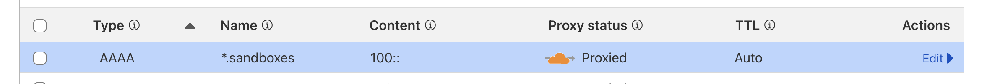
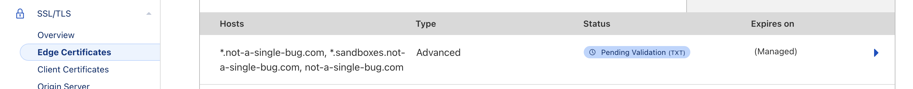

# Cloudflare Containers Multi-Port Routing Example

This project demonstrates how to implement a multi-port container routing system using Cloudflare Workers and Containers. It extends the basic routing example to support multiple services running on different ports within the same container, allowing for more complex application architectures.

## Key Differences from Simple Routing

- **Multiple Services**: Supports routing to different services within the same container using different ports
- **Service-based Routing**: Uses a service identifier in the subdomain (e.g., `container-id-web.sandbox.example.com` for web service, `container-id-time.sandbox.example.com` for time service)
- **Dynamic Port Mapping**: Services are mapped to different ports defined in the `SERVICES` constant

> **Note**: The test scripts might be broken as they haven't been updated to account for the multi-port routing changes. Tests will need to be updated to handle the new service-based routing scheme.

## Features

- Multiple service support within a single container
- Dynamic container management (start/stop)
- Per-service and per container routing based on subdomain pattern
- Admin endpoints for container management
- Basic authentication for admin endpoints
- Configurable container timeouts
- Support for multiple regions

## Endpoints

### Public Endpoints

- `GET /help` - List all available endpoints
- `GET /*` - Routes to the container service specified in the subdomain (e.g., `container-id-web.your-domain.com/` for web service, `container-id-time.your-domain.com/` for time service)

### Admin Endpoints (Requires Authentication)

- `POST /admin/container/:id/start` - Start a container with the specified ID
  - Optional body: `{ "location": "region-code" }` (e.g., "weur" for West Europe)

- `POST /admin/container/:id/stop` - Stop the container with the specified ID
- `POST /admin/container/:id/update-text` - Update text in the container

**Authentication:** Admin endpoints require Basic Auth with the following credentials:
- Username: `cf`
- Password: `testing`

## Getting Started

1. Install dependencies:

```bash
npm install
```

2. Start the development server:

```bash
npm run dev
```

3. Open [http://localhost:8787/help](http://localhost:8787/help) to see available endpoints.

## Configuration

The application supports the following environment variables:

- `HOSTNAME_PATTERN` - Pattern for container hostnames (e.g., `<CONTAINER_ID>.sandbox.example.com`)
- `SANDBOX_CONTAINERS` - Durable Object binding for container instances

## Deployment

Please update `wrangler.jsonc` with your own values for `HOSTNAME_PATTERN` and `SANDBOX_CONTAINERS`. Also update `routes` in `wrangler.jsonc` with your own values for `pattern` and `zone_name`.

Moreover, to allow for wildcard routing for Workers, please also configure DNS and if using nested subdomains, please create a SSL cert that covers the subdomain. More info [here](https://developers.cloudflare.com/workers/configuration/routing/routes/#domains-and-subdomains-must-have-a-dns-record).

DNS:


Cert:


Then deploy to Cloudflare Workers:

```bash
npm run deploy
```

## Container Management

### Local Development

When running locally with `npm run dev`, use these commands:

#### Starting a Container

When you start a container, it will be accessible via multiple URLs, one for each service:

```bash
curl -X POST -u "cf:testing" http://localhost:8787/admin/container/test-container/start
```

This will make the container accessible at:
- `test-container-web.your-domain.com` (web service on port 8080)
- `test-container-time.your-domain.com` (time service on port 8081)

#### Stopping a Container

```bash
curl -X POST -u "cf:testing" http://localhost:8787/admin/container/test-container/stop
```

### Production Deployment

When deployed to Cloudflare Workers, use these commands (replace `your-worker.your-subdomain.workers.dev` with your actual worker URL):

#### Starting a Container

```bash
curl -X POST -u "cf:testing" https://your-worker.your-subdomain.workers.dev/admin/container/test-container/start
```

#### Stopping a Container

```bash
curl -X POST -u "cf:testing" https://your-worker.your-subdomain.workers.dev/admin/container/test-container/stop
```

## Security Note

This example uses basic authentication for demonstration purposes. In production, you should:
1. Use environment variables for credentials
2. Implement proper authentication and authorization
3. Enable HTTPS for all endpoints
4. Implement rate limiting
5. Consider using API tokens or OAuth for authentication

## Learn More

To learn more about Containers, take a look at the following resources:

- [Container Documentation](https://developers.cloudflare.com/containers/) - learn about Containers
- [Container Class](https://github.com/cloudflare/containers) - learn about the Container helper class

Your feedback and contributions are welcome!
